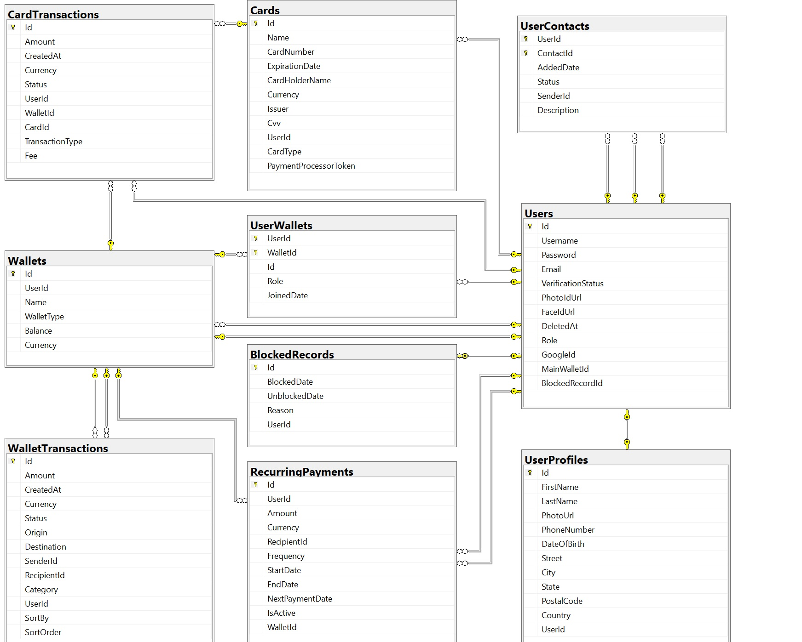

# **Project Overview**

VirtualWallet is a comprehensive and secure digital wallet application designed to facilitate easy and efficient financial transactions. The application is built using ASP.NET Core, providing a robust backend system with a focus on scalability, security, and ease of use. Users can manage their finances, execute transactions, and interact with various financial services seamlessly through the platform.
### Important Note

-   **Sensitive Information in appsettings**: The `appsettings.json` file contains sensitive information, such as API keys and connection strings. This data is exposed intentionally as this is a presentation project. It allows users to easily launch the project on their own. In a production environment, sensitive information should be secured using environment variables or secret management tools.


## Technology Stack

-   **Backend**: ASP.NET Core
-   **Frontend**: Razor Views (with Bootstrap and jQuery for UI components)
-   **Database**: Entity Framework Core with SQL Server
-   **Authentication**: JWT, Google OAuth
-   **Email**: SMTP Email Service with HTML templates
-   **Testing**: Unit tests using MSTest and Moq for mocking dependencies

## **Features**

**User Authentication and Authorization**
 - Secure login and registration functionalities with `JWT (JSON Web Tokens)` to manage user sessions. Integration with `Google OAuth` for streamlined third-party authentication.
- Role-based access control ensures that users can only access features and data relevant to their role (e.g., Admin, Registered User).

**Wallet Management**

- Users can create and manage different types of wallets, such as main wallets and savings wallets, with support for various currencies. 
- Secure and efficient handling of transactions within and across wallets, including support for recurring payments and detailed transaction histories.

**Card Management**

- Users can add and remove cards associated with their accounts. The application supports both virtual and real cards. Verification of the cards is done by a dummy Payment Processor service.
- Detailed management of transactions made using associated cards, including filtering and searching capabilities. 

**Payment Processing**

- Card to Wallet Transactions

	* Handles secure transfer of funds from a user's card to their wallet.
	* Uses BeginTransactionAsync for transaction management.
	* Rolls back and refunds to the card if an error occurs during the transaction.
		
- Wallet to Card Transactions

	* Transfers funds from the user's wallet to their card.
	* Deducts the specified amount plus fees.
	* Uses BeginTransactionAsync to ensure transaction integrity.
	* Rolls back and refunds to the wallet if the transaction fails.

- Wallet to Wallet Transactions
	* Initiates the transfer, including currency conversion if needed.
	* Completes the transfer after recipient verification.
	* Uses BeginTransactionAsync for both steps.
	* Sends verification and confirmation emails to users.
	
- Error Handling
	* Automatically rolls back and refunds to the original payment source if issues arise during the transaction process.
	* Payment Integration: Integration with external payment processors to handle real card transactions securely. This includes deposit and withdrawal operations with proper validation.

**Email Services**

- Automated email services for various user actions, including registration, password reset, and email verification.
- HTML templates for consistent and professional communication with users.
Security Features

**Flow Control**

-   Global `ExceptionHandlingMiddleware` catches and processes exceptions that occur during request processing, ensuring meaningful error messages and appropriate status codes are returned to the client.
-   Using Result Type Pattern, services return a `Result<T>` object to indicate success or failure, allowing for consistent and explicit error handling across the application.
-   Operations are rolled back on failure to maintain data integrity, with detailed error information provided via the `Error` property of the `Result<T>`.

**API Services**

The project exposes a set of RESTful API endpoints for managing wallets, transactions, users, and cards. These APIs facilitate operations such as adding and removing cards, performing transactions, and managing user profiles.

- Wallet API
	- Includes operations for managing wallets, including creating, updating, and retrieving wallets by user ID or name.
- Transaction API
	- Manages wallet and card transactions, offering endpoints for retrieving transaction histories based on user ID, sender ID, or recipient ID.
- User API
	- Provides endpoints for managing user profiles, including updating user information, changing passwords, and handling friend requests.

**Additional Service Integrations**

- Cloudinary Service
	- Handles the uploading of profile pictures and other media files to Cloudinary, ensuring secure and reliable media management.
- Currency Service
	- Retrieves and processes real-time currency exchange rates via the Free Currency API, enabling accurate currency conversions for transactions between wallets with different currencies.
-	Google Auth Service
	-	Manages authentication and registration through Google OAuth, including handling Google login responses and user data integration.

**Swagger Setup**

- API Documentation
	- Swagger is configured to provide interactive API documentation, enabling developers to explore and test API endpoints directly from the browser.
- Security Definitions
	- Includes security definitions for JWT Bearer tokens, allowing for secure access to protected endpoints during API testing.
	Admin Dashboard

**User Management**
-	Admins can view and manage user profiles, including blocking/unblocking users and handling user verification.
-	Detailed transaction logs accessible via the admin panel for monitoring and troubleshooting.

## VirtualWallet Installation Guide

Before you begin, ensure you have the following installed on your machine:

- **.NET Core SDK**: [Download .NET Core SDK](https://dotnet.microsoft.com/download/dotnet-core)
- **SQL Server**: Ensure you have SQL Server installed and running.

## Clone the Repository

To get started, clone the repository to your local machine:

git clone https://github.com/FinalProject-A59-MB/VirtualWallet.git
cd VirtualWallet

## Setup the Database

Database Schema: Below is the database schema diagram representing the structure of the database used in the VirtualWallet project:



1.  **Configure Connection String**:
    
    -   Open the `appsettings.json` file located in the `VirtualWallet.WEB` project.
    -   Update the connection string under `ConnectionStrings:DefaultConnection` to point to your local SQL Server instance.
2.  **Run Database Migrations**:
    
    -   Navigate to the project directory and run the following command to apply migrations and set up the database:
   
    ```bash
    dotnet ef database update --project VirtualWallet.DATA
    ```
## Run the Application

1.  **Navigate to the Web Project**:
    
    -   Move into the `VirtualWallet.WEB` project directory:
    ``` bash
    cd VirtualWallet.WEB
    ```
    
2. **Access the Web Interface**:

	- Open your web browser and navigate to `https://localhost:5000` to start using the application or `https://localhost:5000/api/swagger` to access the Swagger interface.
